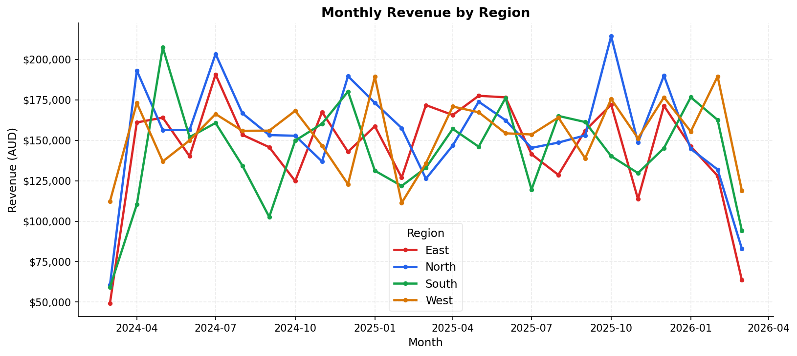
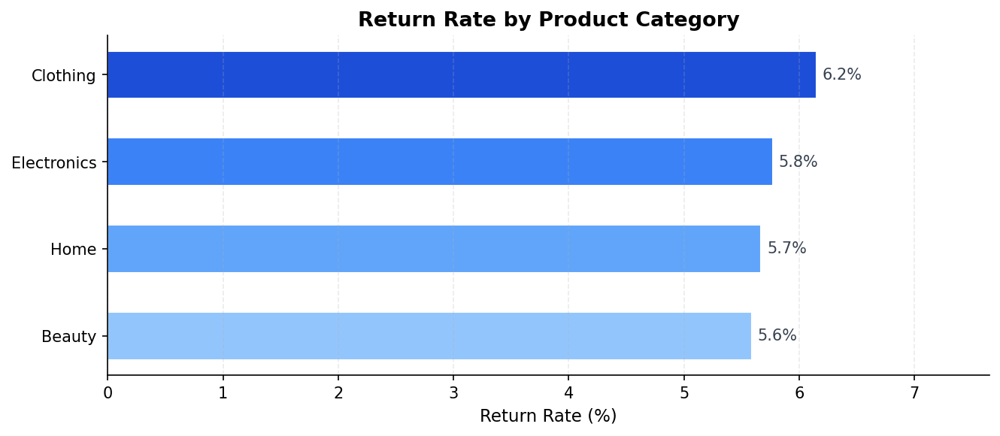
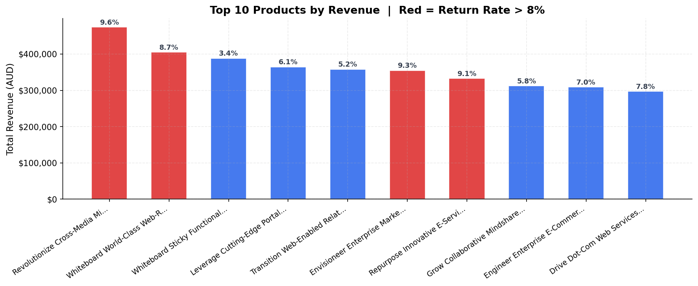
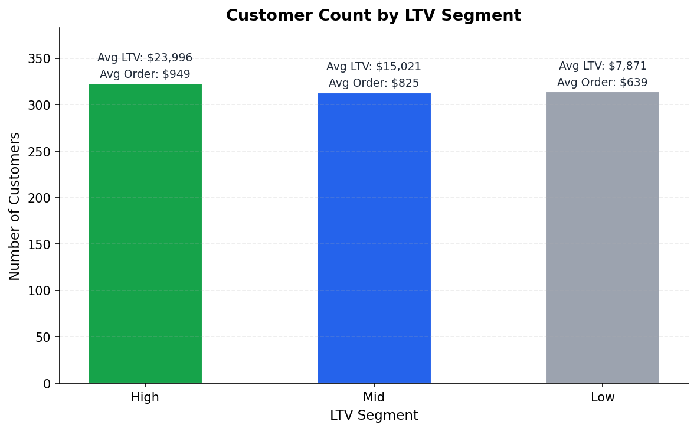

# E-commerce Order Pipeline with Data Quality Framework

This project simulates a production-style data pipeline for an e-commerce business,
moving synthetic order data through bronze, silver, and gold layers using DuckDB and Python.
It includes automated data quality checks validated with pytest, and produces business-facing
outputs on revenue, returns, and customer value.

---

## Architecture

```
Raw CSVs (Faker + NumPy)
        │
        ▼
   [Bronze]  ── Landed as-is. Zero transformation. Immutable audit trail.
        │
        ▼
   [Silver]  ── Cleaned, typed, null-removed, referential integrity enforced.
        │
        ▼
    [Gold]   ── Business aggregates: revenue, returns, products, customer LTV.
        │
        ▼
  [Notebook] ── Four business insight charts. Loaded from gold CSVs.
        │
        ▼
[Quality Report] ── 10 automated checks. Results written to quality_report.csv.
```

---

## Key Features

- **Medallion architecture** in pure Python and DuckDB — no cloud dependencies
- **Deliberate bad data injection** at generation time (~5% of records) so quality checks have real issues to catch
- **63 pytest tests** across bronze, silver, gold, and quality check layers
- **CI** via GitHub Actions runs the test suite on every push

---

## Data Quality Checks

All checks run against the silver layer after each pipeline execution.
Results are written to `data/quality_report.csv`.

| Check | What It Validates | Status |
|---|---|---|
| `no_null_order_ids` | Every order has an identifier | ✅ Pass |
| `no_null_customer_ids` | Every customer has an identifier | ✅ Pass |
| `no_null_product_ids` | Every product has an identifier | ✅ Pass |
| `order_items_have_valid_orders` | All order items link to a valid order | ✅ Pass |
| `returns_have_valid_orders` | All returns link to a valid order | ✅ Pass |
| `no_negative_quantities` | All item quantities are positive | ✅ Pass |
| `no_negative_prices` | All product prices are non-negative | ✅ Pass |
| `return_date_after_order_date` | Return date is always after order date | ✅ Pass |
| `valid_order_status` | Status is one of: completed, cancelled, returned | ✅ Pass |
| `order_total_matches_items` | Order total matches sum of items within 1% | ✅ Pass |

---

## Business Outputs

### Revenue by Region Over Time



West leads revenue. North is flat — worth flagging for regional strategy.

---

### Return Rate by Product Category



Clothing is highest (~6.1%). Beauty is lowest.

---

### Top 10 Products by Revenue with Return Rate



Top revenue product has a 9.6% return rate. Red bars are above 8%.

---

### Customer Lifetime Value Segments



High LTV is roughly 3x Low. Retention budget should skew toward the top two tiers.

---

## How to Run

```bash
git clone https://github.com/souravsudheer/ecommerce-order-pipeline
cd ecommerce-order-pipeline
python3 -m venv venv && source venv/bin/activate
pip install -e .
python pipeline/run_all.py
```

To run the test suite:

```bash
pytest tests/ -v
```

To generate business insight charts:

```bash
python notebooks/generate_charts.py
```

---

## Project Structure

```
ecommerce-order-pipeline/
│
├── data/
│   ├── raw/                  # Synthetic CSVs from generate_data.py
│   ├── bronze/               # Raw data registered in DuckDB, untouched
│   ├── silver/               # Cleaned, typed, referentially intact
│   ├── gold/                 # Business aggregate CSVs and DuckDB tables
│   └── quality_report.csv    # Output of data_quality.py
│
├── pipeline/
│   ├── generate_data.py      # Synthetic data generator with injected bad data
│   ├── bronze.py             # Raw CSV ingestion into DuckDB
│   ├── silver.py             # Cleaning, typing, and filtering
│   ├── gold.py               # Business aggregates
│   ├── data_quality.py       # 10 automated quality checks
│   └── run_all.py            # Single entry point for the full pipeline
│
├── tests/
│   ├── conftest.py           # Shared in-memory DuckDB fixture
│   ├── test_bronze.py        # Table existence, row counts, bad data preserved
│   ├── test_silver.py        # Transformations, nulls removed, types correct
│   ├── test_gold.py          # Aggregates valid, business logic correct
│   └── test_quality.py       # Quality check functions tested on injected bad data
│
├── notebooks/
│   ├── generate_charts.py    # Produces all four business insight charts
│   ├── business_insights.ipynb
│   └── charts/               # PNG outputs embedded in this README
│
├── config.py                 # All paths and constants in one place
├── pyproject.toml
└── README.md
```

---

## Tech Stack

| Tool | Version | Why |
|---|---|---|
| Python | 3.10+ | Primary language for pipeline and tests |
| DuckDB | 1.5.0 | Embedded SQL engine — no server, no Docker, no cloud |
| Faker | 24.x | Reproducible synthetic data generation |
| NumPy | 1.26+ | Controlled random distributions with fixed seed |
| pandas | 2.2+ | Dataframe I/O between DuckDB and CSV |
| pytest | 8.x | Industry-standard test framework |
| matplotlib | 3.8+ | Clean business charts without heavy dependencies |

DuckDB runs in-process with full SQL support — no server needed.

---

## Data Model

Five tables across two fact-dimension relationships.

```
customers     customer_id, name, email, region, signup_date
products      product_id, product_name, category, price
orders        order_id, customer_id, order_date, status, total_amount
order_items   item_id, order_id, product_id, quantity, unit_price, line_total
returns       return_id, order_id, return_date, reason, refund_amount
```

